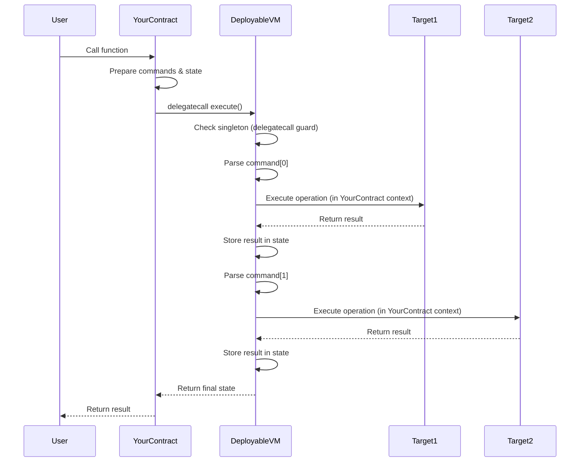

## The Execute Function

At the heart of DeployableVM is the `execute` function, which orchestrates the entire Weiroll script execution:

```solidity
function execute(bytes32[] calldata commands, bytes[] memory state) 
    public 
    payable 
    returns (bytes[] memory) 
{
    // With the event of EIP-6780, we no longer have to guard against `SELFDESTRUCT`,
    // but the following check is added out of an abundance of caution in the event
    // the contract is deployed on a chain that does not support EIP-6780.
    require(address(this) != WEIROLL_SINGLETON, CallableOnlyViaDelegateCall());

    return _execute(commands, state);
}
```

<Info>
  Source: [DeployableVM.sol:22-29](https://github.com/cowprotocol/weiroll/blob/main/src/DeployableVM.sol#L22-L29)
</Info>

### Function Parameters

| Parameter | Type | Description |
|-----------|------|-------------|
| `commands` | `bytes32[] calldata` | Encoded array of operations to execute |
| `state` | `bytes[] memory` | Initial state and storage for intermediate values |
| **Returns** | `bytes[] memory` | Final state after all operations complete |

<Note>
  The function is marked `payable` to support operations that require ETH transfers.
</Note>

## Command Encoding

Each `bytes32` command packs multiple pieces of information:

### Command Structure

A Weiroll command encodes:
- **Target address**: The contract to call (20 bytes)
- **Function selector**: The function to invoke (4 bytes)
- **Flags**: Execution behavior (call type, value handling)
- **Input indices**: Which state slots to use as inputs
- **Output index**: Where to store the result

This compact encoding minimizes calldata costs while maximizing flexibility.

<Accordion title="Example: Command Encoding Breakdown">
```
Command bytes32 structure:
┌─────────────┬──────────┬───────┬──────────┬────────┐
│   Address   │ Selector │ Flags │  Inputs  │ Output │
│  (20 bytes) │ (4 bytes)│(1 byte)│(variable)│(1 byte)│
└─────────────┴──────────┴───────┴──────────┴────────┘
```

The VM unpacks this during execution to determine:
- Which contract to interact with
- What function to call
- Where to get input data
- Where to store output data
</Accordion>

## State Management

The `state` array serves as both input and output storage:

### Initial State
```solidity
bytes[] memory state = new bytes[](5);
state[0] = abi.encode(tokenAddress);
state[1] = abi.encode(amount);
state[2] = abi.encode(recipient);
// state[3] and state[4] reserved for outputs
```

### During Execution
As commands execute:
1. The VM reads inputs from specified state indices
2. Executes the operation
3. Writes results back to specified output indices
4. Subsequent commands can use these results as inputs

### Final State
The returned `state` array contains:
- Original inputs (potentially modified)
- All intermediate results
- Final outputs from the last operations

<Warning>
  State indices must be carefully managed. Reading from an uninitialized or incorrect index will cause reverts or unexpected behavior.
</Warning>

## Delegatecall Execution Pattern

DeployableVM is designed to be used **exclusively via delegatecall**:

### Why Delegatecall?

When you delegatecall into DeployableVM:

```solidity
// In your contract
(bool success, bytes memory result) = address(deployableVM).delegatecall(
    abi.encodeCall(DeployableVM.execute, (commands, state))
);
```

The Weiroll script executes with:
- **Your contract's storage**: Can read and modify your state
- **Your contract's address**: `address(this)` is your contract
- **Your contract's balance**: Can access and transfer your ETH
- **Your contract's context**: `msg.sender` and `msg.value` preserved

### Security Guard

The singleton check prevents direct calls:

```solidity
require(address(this) != WEIROLL_SINGLETON, CallableOnlyViaDelegateCall());
```

This ensures:
- The VM can only execute in a delegatecall context
- No one can trick the singleton into executing operations directly
- Your contract maintains full control over execution

<Info>
  The `WEIROLL_SINGLETON` is set in the constructor to `address(this)` at deployment time, making it immutable.
</Info>

## Execution Lifecycle

Here's the complete flow of a Weiroll script execution:



### Step-by-Step

1. **Preparation**: Your contract encodes operations into commands and initial state
2. **Delegatecall**: Your contract delegates to DeployableVM
3. **Security Check**: VM verifies it's being called via delegatecall
4. **Execution Loop**: VM iterates through each command:
   - Decode command parameters
   - Read inputs from state array
   - Execute the operation on the target contract
   - Write outputs back to state array
5. **Return**: Final state array is returned to your contract

## Code Example: Real Implementation

Here's how DeployableVM is tested to work via delegatecall:

```solidity
function test_callable_via_delegatecall() public {
    bytes32[] memory commands = new bytes32[](0);
    bytes[] memory state = new bytes[](0);

    (bool success,) = address(weiVm).delegatecall(
        abi.encodeCall(DeployableVM.execute, (commands, state))
    );
    assertTrue(success);
}
```

<Info>
  Source: [DeployableVM.t.sol:22-28](https://github.com/cowprotocol/weiroll/blob/main/test/DeployableVM.t.sol#L22-L28)
</Info>

And the test that verifies direct calls are rejected:

```solidity
function test_reverts_if_not_delegatecall() public {
    bytes32[] memory commands = new bytes32[](0);
    bytes[] memory state = new bytes[](0);

    vm.expectRevert(DeployableVM.CallableOnlyViaDelegateCall.selector);
    weiVm.execute(commands, state);
}
```

<Info>
  Source: [DeployableVM.t.sol:14-20](https://github.com/cowprotocol/weiroll/blob/main/test/DeployableVM.t.sol#L14-L20)
</Info>

## Inheritance Chain

DeployableVM extends the core Weiroll VM:

```solidity
import {VM as WeirollVM} from "lib/enso-weiroll/contracts/VM.sol";

contract DeployableVM is WeirollVM {
    // Adds delegatecall-only enforcement
    // Inherits _execute() implementation from WeirollVM
}
```

This design:
- Leverages the battle-tested Enso Finance implementation
- Adds a security layer for safe deployment
- Maintains compatibility with existing Weiroll tooling

## Performance Considerations

### Gas Efficiency

- **Calldata costs**: Commands are tightly packed `bytes32` values
- **State reuse**: Intermediate values don't require additional storage
- **Single transaction**: All operations execute atomically

### Limitations

- **Command complexity**: More complex scripts require more gas
- **State array size**: Large state arrays increase memory costs
- **Delegatecall overhead**: Small fixed cost per delegatecall

<Note>
  For simple operations, a direct call may be more gas-efficient. Weiroll shines when composing multiple operations.
</Note>

## Next Steps

<CardGroup cols={2}>
  <Card title="Security Model" icon="shield" href="/concepts/security-model">
    Learn about security guarantees and best practices
  </Card>
  <Card title="Integration Guide" icon="code" href="/guides/integration">
    Start integrating DeployableVM into your project
  </Card>
</CardGroup>